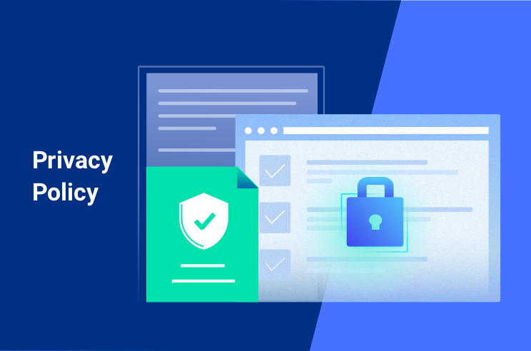
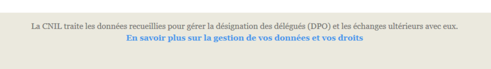

# Private Policy

*  🔖 **Cas de figure**
*  🔖 **À quels moments**
*  🔖 **Le format**

___

## 📑 Cas de figure

Vous devez informer les personnes concernées :

* En cas de collecte directe des données : lorsque les données sont recueillies directement auprès des personnes (exemples : formulaire, achat en ligne, souscription d’un contrat, ouverture d’un compte bancaire) ou lorsqu’elles sont recueillies via des dispositifs ou des technologies d’observation de l’activité des personnes (exemples : vidéosurveillance, analyse de la navigation sur Internet, géolocalisation et wifi analytics/tracking pour la mesure d’audience, etc.);

* En cas de collecte indirecte des données personnelles : lorsque les données ne sont pas recueillies directement auprès des personnes (exemples : données récupérées auprès de partenaires commerciaux, de data brokers, de sources accessibles au public ou d’autres personnes).

🔗 [Référence](https://www.cnil.fr/en/node/24281)

___

## 📑 À quels moments

* En cas de collecte directe : au moment du recueil des données.

* En cas de collecte indirecte : dès que possible (notamment lors du 1er contact avec la personne concernée) et, au plus tard, dans le délai d’un mois (sauf exceptions).

___

## 📑 Le format

La personne concernée par un traitement de données doit recevoir une information délivrée : de façon concise, transparente, compréhensible et aisément accessible, en des tiermes clairs et simples.

Par exemple, sur un site internet, vous pouvez utiliser un lien renvoyant directement vers la politique de protection des données, clairement visible sur chaque page du site, intitulé de manière claire (« Données personnelles » ou « Confidentialité » par exemple).

Cette politique de confidentialité doit être distincte des conditions générales de vente (CGV) ou des conditions générales d’utilisation (CGU) du site internet.

🔗 [Exemples](https://www.cnil.fr/fr/rgpd-exemples-de-mentions-dinformation) 

___

## 📑 Mentions

Les mentions suivantes doivent $etre inclues dans la Private policy.

* Conditions Générales d'Utilisation
* [Conditions Générales de Vente]
* Mentions d’informations des personnes concernées

🔗 [Modèle](https://www.wonder.legal/fr/creation-modele/politique-confidentialite)

___

👨🏻‍💻 Manipulation

Créez votre page de politique de confidentialité

___
