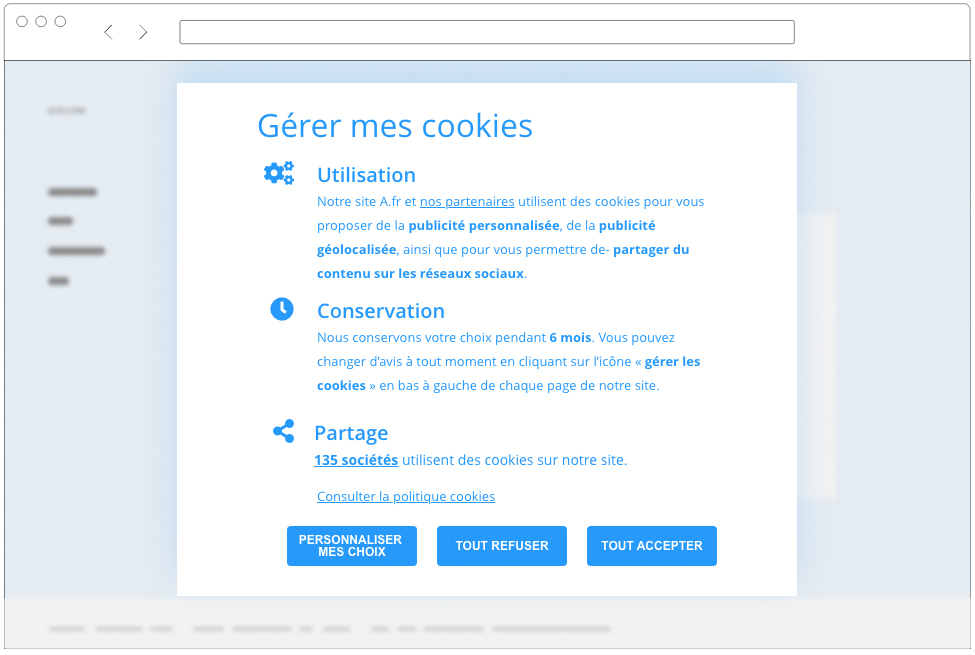
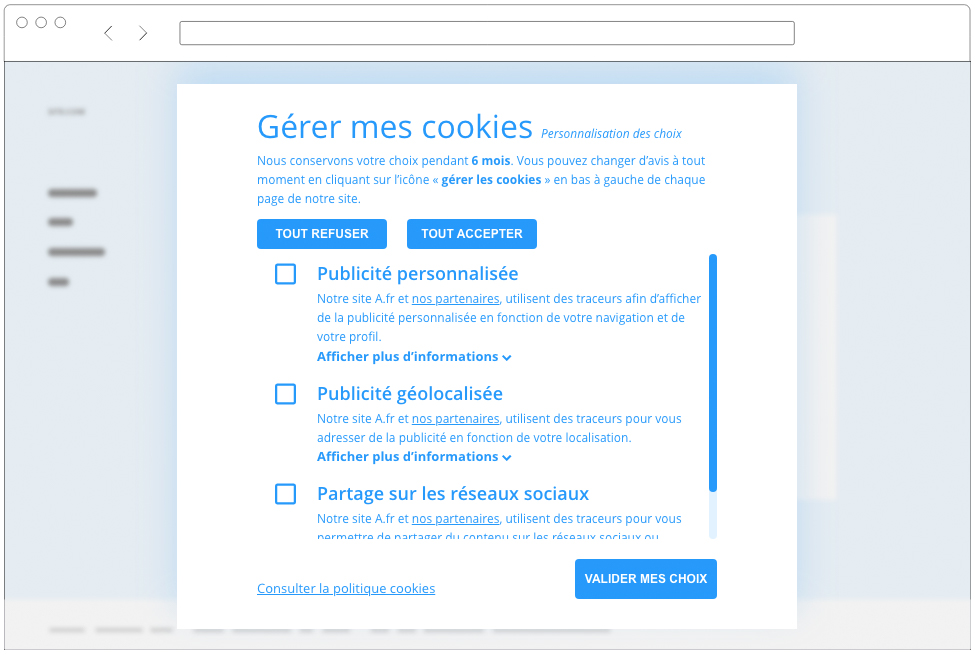

# Cookies

*  🔖 **Obligation**
*  🔖 **Implémentation**

___

## 📑 Obligation

Vous devez informer les personnes concernées :

Avant de déposer ou lire un cookie, les éditeurs de sites ou d'applications doivent :

* Informer les internautes de la finalité des cookies.
* Obtenir leur consentement (la durée de validité de ce consentement est de 13 mois maximum).
* Fournir aux internautes un moyen de les refuser.

Certains cookies sont cependant dispensés du recueil de ce consentement (ceux strictement nécessaires à la fourniture d'un service expressément demandé par l'utilisateur).

En cas de collecte indirecte des données personnelles : lorsque les données ne sont pas recueillies directement auprès des personnes (exemples : données récupérées auprès de partenaires commerciaux, de data brokers, de sources accessibles au public ou d’autres personnes).

[Référence](https://www.cnil.fr/fr/cookies-et-traceurs-comment-mettre-mon-site-web-en-conformite)

___

## 📑 Implémentation

Pour qu'il soit valide le consentement doit:

* Informer l’utilisateur
* Permettre à l’utilisateur de consentir par un acte positif clair
* Permettre à l’utilisateur de faire un choix par finalité
* Permettre à l’utilisateur d’exercer ses choix avec le même degré de simplicité 
* Permettre à l’utilisateur de revenir sur sa décision à tout moment
* Il vous faut vous souvenir de la preuve du consentement.

### 🏷️ **La page du consentement**

Il faut également informer l'utilisateur su la finalité du cookie. Cela peut être sans une section dédiée de la page des mentions légales ou être un texte informatif après action.

#### **Exemple**

Les cookies sont des petits fichiers textes qui peuvent être utilisés par les sites Web pour rendre l'expérience utilisateur plus efficace. La loi stipule que nous ne pouvons stocker des cookies sur votre appareil que s’ils sont strictement nécessaires au fonctionnement de ce site. Pour tous les autres types de cookies, nous avons besoin de votre permission. Ce site utilise différents types de cookies. Certains cookies sont placés par les services tiers qui apparaissent sur nos pages. À tout moment, vous pouvez modifier ou retirer votre consentement dès la Déclaration relative aux cookies sur notre site Web. En savoir plus sur qui nous sommes, comment vous pouvez nous contacter et comment nous traitons les données personnelles veuillez voir notre Politique confidentialité. Votre consentement s'applique aux domaines suivants : www.foo.com

___

👨🏻‍💻 Manipulation

Implémentez le consentement des cookies.